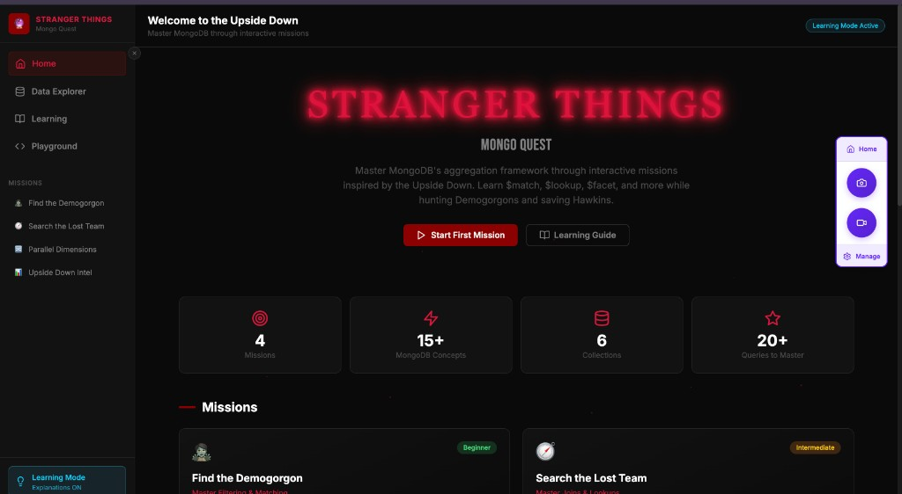
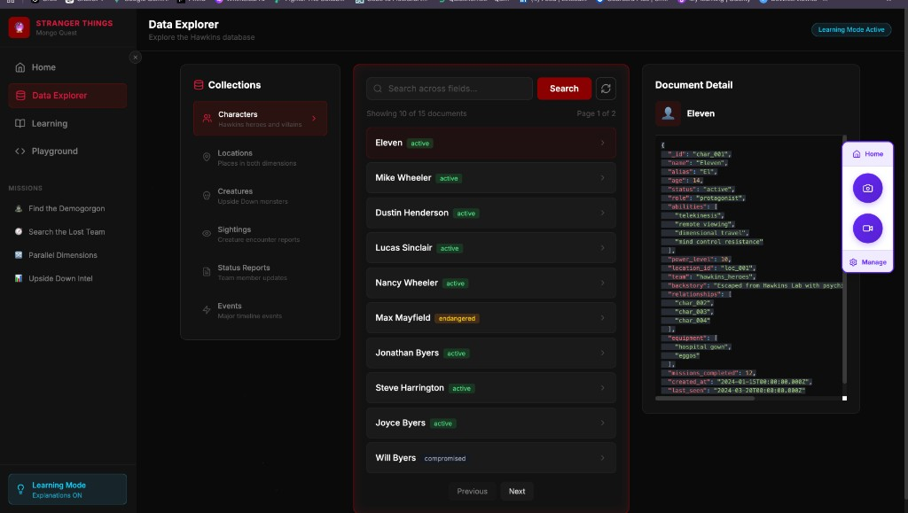
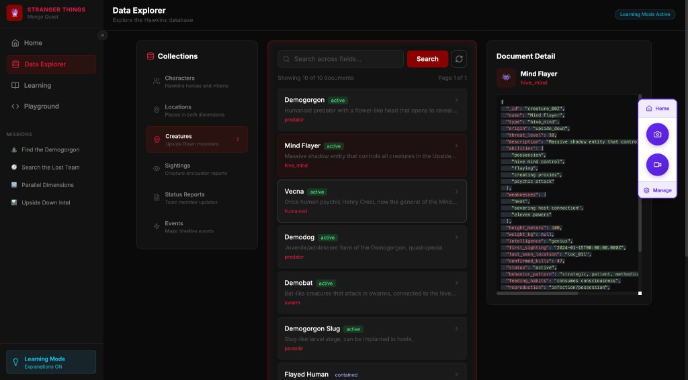
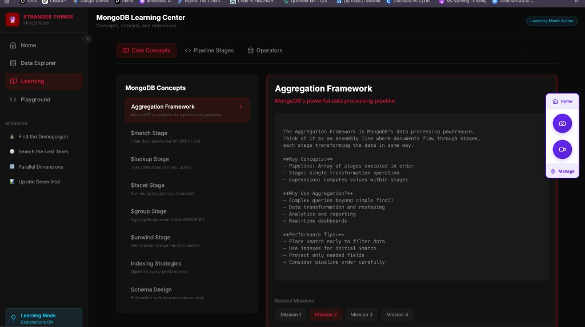
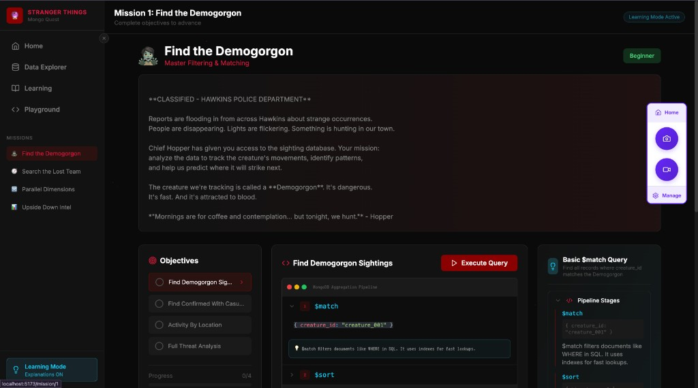

# Stranger Things Mongo Quest

## Project Overview

This frontend implementation is part of the **Stranger Things Mongo Quest** project, an interactive learning platform that combines **MongoDB** and **React** concepts to teach database querying through gamified missions.

---

## Portal UI Screenshots

These images document the floating **portal** toolbar on the right (Home, screenshot capture, screen recording, and Manage) and how it appears across the app, including sidebar mission portal icons on the Learning view.

### Home — welcome dashboard



### Data Explorer — Characters collection



### Data Explorer — Creatures collection



### Learning — Core concepts (Aggregation Framework)



### Mission — Find the Demogorgon



---

### What This Project Teaches

**MongoDB Concepts:**
- Aggregation pipelines (`$match`, `$group`, `$lookup`, `$facet`, etc.)
- Query optimization and performance
- Data relationships and joins
- Real-world database patterns

**React Concepts:**
- Modern React with Hooks (`useState`, `useEffect`, `useParams`, etc.)
- React Router v6 for navigation
- Component composition and patterns
- State management and prop drilling
- Form handling and validation
- Performance optimization techniques
- Build tools (Vite) and styling (Tailwind CSS)

### Learning Approach

This codebase serves as both:
1. **A working application** - A fully functional MongoDB learning platform
2. **A learning resource** - Comprehensive documentation with 58+ React interview questions and answers
3. **A reference implementation** - Real-world patterns and best practices

Each component demonstrates practical React patterns while teaching MongoDB aggregation concepts through interactive missions inspired by the Stranger Things universe.

---

## Table of Contents
1. [Project Structure Overview](#1-project-structure-overview)
2. [File-by-File Breakdown](#2-file-by-file-breakdown)
3. [Configuration Files](#3-configuration-files)
4. [Key Patterns Used](docs/key-patterns-used.md)
5. [Complete React Questions & Answers](docs/react-questions-answers.md)
6. [MongoDB Concepts & Advanced Questions](docs/mongodb-questions-answers.md)
7. [Portal UI Screenshots](#portal-ui-screenshots)

---

## 1. Project Structure Overview

```
frontend/
├── index.html          # Entry HTML file
├── src/
│   ├── main.jsx        # React app entry point
│   ├── App.jsx         # Root component + routing
│   ├── index.css       # Global styles (Tailwind)
│   ├── components/     # Reusable UI components
│   │   ├── Layout.jsx
│   │   ├── ExplanationPanel.jsx
│   │   ├── QueryEditor.jsx
│   │   └── ResultsPanel.jsx
│   └── pages/          # Route-specific pages
│       ├── Home.jsx
│       ├── Mission.jsx
│       ├── DataExplorer.jsx
│       ├── Learning.jsx
│       └── Playground.jsx
├── images/             # Portal UI documentation screenshots
├── package.json        # Dependencies
├── vite.config.js      # Build tool config
├── tailwind.config.js  # Tailwind CSS config
└── postcss.config.js   # PostCSS config
```

---

## 2. File-by-File Breakdown

### FILE 1: `index.html` (Entry Point)

**Key Concepts:**
- **`<div id="root">`** - The mounting point where React renders the entire app
- **`type="module"`** - Uses ES modules for JavaScript
- **`preconnect`** - Performance optimization for fonts

### FILE 2: `main.jsx` (React Entry Point)

**React Concepts:**

| Concept | Explanation |
|---------|-------------|
| **`ReactDOM.createRoot()`** | React 18's new API for rendering (replaces `ReactDOM.render()`) |
| **`React.StrictMode`** | Development tool that highlights potential problems (double-invokes effects, warns about deprecated APIs) |
| **Root Component** | `<App />` is the top-level component that contains the entire application |

### FILE 3: `App.jsx` (Root Component + Routing)

**React Concepts Demonstrated:**

#### A. **Hooks**

| Hook | Usage | Purpose |
|------|-------|---------|
| `useState` | `const [learningMode, setLearningMode] = useState(true)` | Manages component state |
| `useEffect` | `useEffect(() => {...}, [])` | Side effects (runs once on mount due to empty dependency array `[]`) |

#### B. **React Router v6**

| Concept | Code | Purpose |
|---------|------|---------|
| `BrowserRouter` | `<Router>...</Router>` | Wraps app to enable routing |
| `Routes` | `<Routes>...</Routes>` | Container for route definitions |
| `Route` | `<Route path="/mission/:id" element={...} />` | Defines URL → Component mapping |
| **Dynamic Route** | `:id` in `/mission/:id` | URL parameter (extracted with `useParams`) |

#### C. **Props Passing**

```jsx
<Layout learningMode={learningMode} setLearningMode={setLearningMode}>
```
- **Props** = data passed from parent to child
- **Lifting State Up** = state managed in parent, passed down as props

#### D. **List Rendering with `key`**

```jsx
{particles.map((p) => (
  <div key={p.id} className="particle" ... />
))}
```
- **`key`** is mandatory for list items (helps React identify which items changed)

### FILE 4: `Layout.jsx` (Layout Component)

**React Concepts:**

| Concept | Code | Explanation |
|---------|------|-------------|
| **`children` prop** | `{ children }` | Special prop that contains nested elements |
| **`useLocation`** | `const location = useLocation()` | Hook from React Router to get current URL |
| **Conditional Rendering** | `{sidebarOpen && <span>...</span>}` | Show/hide elements based on state |
| **Conditional Classes** | `` `${isActive ? 'active' : ''}` `` | Dynamic CSS classes with template literals |
| **Component as Variable** | `const Icon = item.icon` | Store component in variable, render with `<Icon />` |

### FILE 5: `Home.jsx` (Page Component with Data Fetching)

**React Concepts:**

| Concept | Pattern | Explanation |
|---------|---------|-------------|
| **Loading State Pattern** | `loading ? <Skeleton /> : <Content />` | Show placeholder while data loads |
| **Data Fetching** | `fetch()` in `useEffect` | API calls on component mount |
| **Async/Await** | `const fetchMissions = async () => {...}` | Modern async handling |
| **Error Handling** | `try/catch/finally` | Handle errors, always stop loading |
| **Framer Motion** | `<motion.div initial={...} animate={...}>` | Animation library integration |

### FILE 6: `Mission.jsx` (Complex State Management)

**React Concepts:**

| Concept | Code | Explanation |
|---------|------|-------------|
| **`useParams`** | `const { id } = useParams()` | Extract URL parameters from route |
| **Dependency Array** | `useEffect(..., [id])` | Re-run effect when `id` changes |
| **Multiple States** | Multiple `useState` calls | Each piece of state is independent |
| **Optional Chaining** | `data.queries?.length` | Safely access nested properties |
| **Immutable Update** | `[...completedQueries, queryName]` | Create new array instead of mutating |

### FILE 7: `ExplanationPanel.jsx` (Expandable Sections Pattern)

**React Concepts:**

| Concept | Pattern | Explanation |
|---------|---------|-------------|
| **Early Return** | `if (!explanation) return null` | Guard clause for missing data |
| **Accordion Pattern** | Toggle `expandedSection` state | Only one section open at a time |
| **Prop Renaming** | `icon: Icon` | Rename prop while destructuring |
| **Composition** | `<Section>{children}</Section>` | Wrap content with component |

### FILE 8: `DataExplorer.jsx` (Pagination & Search)

**React Concepts:**

| Concept | Code | Explanation |
|---------|------|-------------|
| **Multiple Dependencies** | `[selectedCollection, pagination.page]` | Re-fetch when either changes |
| **Controlled Input** | `value={searchQuery} onChange={(e) => setSearchQuery(e.target.value)}` | React controls input value |
| **URL Encoding** | `encodeURIComponent(searchQuery)` | Safely encode user input for URLs |
| **Object State** | `pagination` as object | Group related state together |
| **State Update with Spread** | `setPagination({ ...pagination, page: 1 })` | Update one property, keep others |

### FILE 9: `ResultsPanel.jsx` (Clipboard API)

**React Concepts:**

| Concept | Code | Explanation |
|---------|------|-------------|
| **Web APIs in React** | `navigator.clipboard.writeText()` | Using browser APIs |
| **Temporary State** | `setTimeout(() => setCopied(false), 2000)` | Reset state after delay |
| **Error Handling** | `try/catch` | Handle API failures gracefully |

### FILE 10: `Playground.jsx` (Form Handling & Validation)

**React Concepts:**

| Concept | Pattern | Explanation |
|---------|---------|-------------|
| **Form State Reset** | `setError(null)` before execution | Clear previous errors |
| **JSON Parsing** | `JSON.parse(pipeline)` | Convert string to object (can throw) |
| **POST Request** | `method: 'POST', body: JSON.stringify(...)` | Sending data to API |
| **Error State** | `error` vs `results` mutually exclusive | Only show one at a time |

---

## 3. Configuration Files

### `vite.config.js`

**Concepts:**
- **Vite** - Modern build tool (faster than webpack)
- **Proxy** - Forward `/api` requests to backend (avoids CORS issues)

### `tailwind.config.js`

**Concepts:**
- **content** - Which files to scan for classes
- **extend** - Add custom colors/animations without overwriting defaults

---

## 4. Key Patterns Used in This Codebase

The full patterns section has been moved to:

- [`docs/key-patterns-used.md`](docs/key-patterns-used.md)

---

## 5. Complete React Questions & Answers

The full React Q&A section has been moved to:

- [`docs/react-questions-answers.md`](docs/react-questions-answers.md)

---

## MongoDB Concepts & Advanced Questions

The full MongoDB concepts and Q&A section has been moved to:

- [`docs/mongodb-questions-answers.md`](docs/mongodb-questions-answers.md)

---

## Summary

This README provides a comprehensive guide to:

### React Development
- Understanding the frontend architecture and component structure
- Learning React concepts through real code examples from this project
- Mastering React Hooks, Router, State Management, and Performance optimization
- Preparing for React interviews with 58 detailed Q&A covering all major topics
- Understanding 15+ common patterns and best practices used in production code

### MongoDB Learning
- Interactive platform for learning MongoDB aggregation pipelines
- Real-world query examples and optimization techniques
- Integration of MongoDB concepts with React frontend

### How to Use This Guide

1. **For Learning React:** Start with the file-by-file breakdown, then dive into the interview questions
2. **For Learning MongoDB:** Explore the Mission pages and Playground to see aggregation pipelines in action
3. **For Interview Prep:** Review all 58 questions and answers, focusing on areas you're less familiar with
4. **For Development:** Reference the patterns section when building new features

**This project uniquely combines MongoDB database concepts with modern React development, making it an excellent resource for full-stack learning!**

Use this as a reference while developing and as a study guide for interviews!
